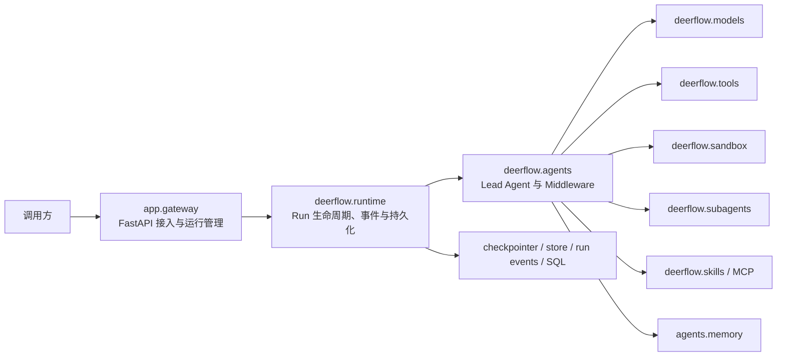

# DeerFlow 后端源码学习指南

> 适用仓库：DeerFlow 2.x 当前代码结构
>
> 学习范围：仅后端，不包含 `frontend/`
>
> 建议起点：已经理解 FastAPI 路由、Python `async/await`、LangGraph 基础，以及 DeerFlow 中的 thread、run、checkpoint、`start_run()`、`run_agent()`；当前正在学习 middleware。

## 1. 这份指南怎么用

这不是一份“按目录从上到下读完”的文件清单，而是一条围绕真实请求生命周期展开的源码学习路线。建议始终带着下面这条主线阅读：

```text
HTTP 请求
  → Gateway 路由
  → start_run 创建并登记 Run
  → 后台任务 run_agent
  → 构建 Lead Agent
  → Middleware 链处理模型与工具调用
  → LangGraph 持续产出事件
  → checkpoint / run event / run metadata 持久化
  → StreamBridge 转成 SSE
```

推荐每天投入 1.5～2 小时，按照“读代码 40% + 跑测试 30% + 做实验 30%”分配时间。完整路线约 8～10 周；如果只想先掌握核心 Agent 运行机制，完成第 1～5 阶段即可。

阅读过程中不要追求记住全部中间件、配置项和边界分支。每学完一个模块，只要能回答本节列出的“验收问题”，就可以进入下一阶段。

## 2. 你的当前基础与学习策略

你已经具备以下基础，本指南不再重复讲解：

- FastAPI 的路由、依赖注入和请求处理基础；
- Python `async/await` 基础；
- LangChain4j、LangGraph4j 和 LangGraph 的基础概念；
- DeerFlow 中 thread、run、checkpoint 的基本含义；
- `start_run()` 和 `run_agent()` 的初步调用关系。

接下来最需要补齐的是 Python LangChain Agent 的运行时细节，以及 DeerFlow 在标准 Agent 循环外增加的工程能力：

- middleware 的组合顺序和生命周期；
- Agent、工具、模型、prompt、state 是如何动态装配的；
- 一次 run 的控制面、执行面、事件面和持久化面如何分工；
- sandbox、subagent、skills、MCP、memory 如何接入同一条执行链；
- 如何通过测试定位模块契约，而不是只靠阅读实现猜行为。

如果用 Java 生态作类比，可以先建立下面的映射，但不要把它们理解成完全等价：

| 已有认知 | DeerFlow / Python 中重点关注的对象 |
| --- | --- |
| LangChain4j `ChatLanguageModel` | `BaseChatModel` 与 `create_chat_model()` |
| LangChain4j Tool / `@Tool` | LangChain `BaseTool`、`@tool`、Injected Runtime |
| LangGraph4j State / Reducer | `ThreadState`、`Annotated` reducer、checkpoint channel |
| Graph 编译与运行 | `create_agent()` 返回的 LangGraph、`agent.astream()` |
| 拦截器 / AOP | `AgentMiddleware` 的 model、tool、agent hooks |
| 线程级状态 | LangGraph thread + checkpointer |
| 一次执行 | DeerFlow `RunRecord` + `run_id` + 后台 task |

## 3. 先建立后端全景图

DeerFlow 后端有一条必须牢记的依赖边界：



- `backend/app/` 是应用层，负责 FastAPI Gateway、认证授权和外部接入。
- `backend/packages/harness/deerflow/` 是可独立发布的 Agent 框架层。
- 依赖方向只能是 `app → deerflow`，不能让 harness 反向导入 `app`。
- 该边界由 [`test_harness_boundary.py`](../backend/tests/test_harness_boundary.py) 自动检查。

开始深入前，先快速阅读：

1. 根目录 [`AGENTS.md`](../AGENTS.md)：理解服务拓扑和仓库边界；
2. 后端 [`AGENTS.md`](../backend/AGENTS.md)：把它当成后端架构索引，而不是一次背完；
3. [`backend/langgraph.json`](../backend/langgraph.json)：确认 graph factory、auth 和 checkpointer 入口；
4. [`backend/packages/harness/pyproject.toml`](../backend/packages/harness/pyproject.toml)：了解 harness 的核心依赖；
5. [`backend/pyproject.toml`](../backend/pyproject.toml)：了解应用层与开发依赖。

## 4. 一次请求的“黄金调用链”

后续学习任何模块时，都要尝试把它放回这条链路。

### 4.1 Gateway 接收并规范化请求

从以下文件开始：

1. [`thread_runs.py`](../backend/app/gateway/routers/thread_runs.py)：重点看 `RunCreateRequest`、`create_run()`、`stream_run()`、`wait_run()`、`join_run()` 和 `cancel_run()`；
2. [`runs.py`](../backend/app/gateway/routers/runs.py)：对比 stateless run 与 thread-scoped run；
3. [`services.py`](../backend/app/gateway/services.py)：重点看 `normalize_input()`、`build_run_config()`、`apply_checkpoint_to_run_config()` 和 `start_run()`。

此处要看懂三个动作：

- 将外部请求转换成可信、结构稳定的 graph input 和 runtime config；
- 把认证用户、thread、run、模型选择等信息写入正确的 config/context；
- 通过 `RunManager` 创建 run，并把 `run_agent()` 放入后台任务执行。

### 4.2 RunManager 管理运行生命周期

阅读：

- [`runtime/runs/manager.py`](../backend/packages/harness/deerflow/runtime/runs/manager.py)
- [`runtime/runs/schemas.py`](../backend/packages/harness/deerflow/runtime/runs/schemas.py)
- [`runtime/runs/worker.py`](../backend/packages/harness/deerflow/runtime/runs/worker.py)

重点区分：

- `RunRecord`：一次 run 的身份、状态、后台 task 和运行元数据；
- `RunManager`：创建、查找、取消、冲突策略和状态转换；
- `run_agent()`：真正调用 graph、消费流事件、收尾和持久化；
- `multitask_strategy`：同一 thread 中已有 run 时，新 run 如何处理冲突；
- “run 已结束”和“run 已完成最终持久化”并不总是同一瞬间。

### 4.3 Agent 工厂动态组装 Graph

阅读：

1. [`lead_agent/agent.py`](../backend/packages/harness/deerflow/agents/lead_agent/agent.py) 的 `make_lead_agent()`、`_make_lead_agent()` 和 `build_middlewares()`；
2. [`agents/factory.py`](../backend/packages/harness/deerflow/agents/factory.py) 的 `create_deerflow_agent()`；
3. [`lead_agent/prompt.py`](../backend/packages/harness/deerflow/agents/lead_agent/prompt.py)；
4. [`agents/thread_state.py`](../backend/packages/harness/deerflow/agents/thread_state.py)；
5. [`models/factory.py`](../backend/packages/harness/deerflow/models/factory.py)；
6. [`tools/tools.py`](../backend/packages/harness/deerflow/tools/tools.py)。

这一层不是返回一个固定全局 Agent，而是根据本次运行的配置解析：

- 使用哪个模型，是否启用 thinking / vision；
- 使用默认 Agent 还是 custom agent；
- 哪些 tools、skills、MCP tools 和 subagents 可用；
- 是否启用 plan mode、memory、summarization、token budget 等能力；
- 最终 middleware 链的实际组成与顺序。

### 4.4 Graph 执行、事件发布与收尾

回到 [`worker.py`](../backend/packages/harness/deerflow/runtime/runs/worker.py)，追踪 `run_agent()` 中：

1. `agent_factory(config)`；
2. `agent.astream(...)`；
3. 不同 `stream_mode` 的 chunk 如何被序列化；
4. chunk 如何写入 `RunJournal`、event store，并发布到 `StreamBridge`；
5. 正常结束、异常、取消、中断时如何设置最终 run 状态；
6. 最终 checkpoint、标题、workspace changes 和 token usage 如何收尾。

再阅读：

- [`runtime/journal.py`](../backend/packages/harness/deerflow/runtime/journal.py)
- [`runtime/stream_bridge/base.py`](../backend/packages/harness/deerflow/runtime/stream_bridge/base.py)
- [`runtime/stream_bridge/memory.py`](../backend/packages/harness/deerflow/runtime/stream_bridge/memory.py)
- [`app/gateway/services.py`](../backend/app/gateway/services.py) 中的 `sse_consumer()` 和 `wait_for_run_completion()`。

完成这条黄金链后，你应该能在纸上画出“一条用户消息从 HTTP 到最终 checkpoint”的时序图。

## 5. 阶段一：吃透 Middleware（当前阶段，建议 1～2 周）

### 5.1 先理解 Middleware 的五类切入点

不要一开始逐个背中间件。先从 `AgentMiddleware` 的生命周期理解它能改变什么：

| 切入点 | 主要用途 | 阅读时关注 |
| --- | --- | --- |
| `before_agent` / `abefore_agent` | 一次 Agent 执行前初始化或补充 state | 返回的是 state update 还是控制命令 |
| `wrap_model_call` / `awrap_model_call` | 包裹模型调用 | 修改 messages、tools、model，还是处理异常/重试 |
| `after_model` / `aafter_model` | 模型返回后处理 | 是否修改 `AIMessage`、tool calls 或终止原因 |
| `wrap_tool_call` / `awrap_tool_call` | 包裹工具调用 | 授权、审计、异常归一化、结果元数据 |
| `after_agent` / `aafter_agent` | 一轮结束后收尾 | 标题、memory 入队、指标、持久上下文 |

每读一个 middleware，都用下面六个问题做笔记：

1. 它拦截 model、tool 还是整个 agent？
2. 它读取哪些 state/config/context？
3. 它写回哪些字段或 message？
4. 它能否短路后续执行或触发 `Command` / interrupt？
5. 为什么必须放在当前顺序？
6. 对应测试锁定了哪些契约？

### 5.2 先看装配代码，再看单个实现

第一遍只读 middleware 的装配入口：

1. [`tool_error_handling_middleware.py`](../backend/packages/harness/deerflow/agents/middlewares/tool_error_handling_middleware.py) 中的 `_build_runtime_middlewares()`；
2. [`lead_agent/agent.py`](../backend/packages/harness/deerflow/agents/lead_agent/agent.py) 中的 `build_middlewares()`；
3. 同一文件中的 `build_subagent_runtime_middlewares()`，对比 Lead Agent 与 Subagent 共用和不同的部分。

必须理解一个容易踩坑的规则：middleware 列表顺序不仅是“执行先后”，还决定 wrapper 的嵌套关系；某些 after hook 又会以反向顺序触发。因此，移动一项可能同时改变模型调用、工具调用和 after hook 的相对语义。代码中的 ordering assertion 和测试不是多余防御。

### 5.3 按难度阅读，而不是按链中顺序阅读

#### 第一组：状态准备与资源生命周期

依次阅读：

- [`thread_data_middleware.py`](../backend/packages/harness/deerflow/agents/middlewares/thread_data_middleware.py)
- [`uploads_middleware.py`](../backend/packages/harness/deerflow/agents/middlewares/uploads_middleware.py)
- [`sandbox/middleware.py`](../backend/packages/harness/deerflow/sandbox/middleware.py)
- [`dynamic_context_middleware.py`](../backend/packages/harness/deerflow/agents/middlewares/dynamic_context_middleware.py)

目标：看懂 middleware 如何从 thread/config/context 中解析信息，再把目录、sandbox、上传文件和动态上下文注入 state/messages。

配套测试：

- [`test_thread_data_middleware.py`](../backend/tests/test_thread_data_middleware.py)
- [`test_sandbox_middleware.py`](../backend/tests/test_sandbox_middleware.py)
- [`test_dynamic_context_middleware.py`](../backend/tests/test_dynamic_context_middleware.py)
- [`test_uploads_middleware_core_logic.py`](../backend/tests/test_uploads_middleware_core_logic.py)

#### 第二组：工具调用的可靠性与安全边界

依次阅读：

- [`tool_error_handling_middleware.py`](../backend/packages/harness/deerflow/agents/middlewares/tool_error_handling_middleware.py)
- [`tool_result_meta.py`](../backend/packages/harness/deerflow/agents/middlewares/tool_result_meta.py)
- [`tool_output_budget_middleware.py`](../backend/packages/harness/deerflow/agents/middlewares/tool_output_budget_middleware.py)
- [`read_before_write_middleware.py`](../backend/packages/harness/deerflow/agents/middlewares/read_before_write_middleware.py)
- [`tool_progress_middleware.py`](../backend/packages/harness/deerflow/agents/middlewares/tool_progress_middleware.py)
- [`sandbox_audit_middleware.py`](../backend/packages/harness/deerflow/agents/middlewares/sandbox_audit_middleware.py)

目标：理解一个工具结果如何从成功值或异常，变成结构统一、可让模型恢复、可审计的 `ToolMessage`。

特别比较：

- `ToolErrorHandlingMiddleware` 解决“工具抛异常后 run 是否继续”；
- `ToolProgressMiddleware` 解决“工具虽然执行了，但是否持续没有新信息”；
- `LoopDetectionMiddleware` 解决“模型是否重复生成相同调用模式”；
- `ReadBeforeWriteMiddleware` 解决“写文件前是否读过当前版本”。

#### 第三组：上下文、技能与长对话

依次阅读：

- [`skill_activation_middleware.py`](../backend/packages/harness/deerflow/agents/middlewares/skill_activation_middleware.py)
- [`skill_tool_policy_middleware.py`](../backend/packages/harness/deerflow/agents/middlewares/skill_tool_policy_middleware.py)
- [`durable_context_middleware.py`](../backend/packages/harness/deerflow/agents/middlewares/durable_context_middleware.py)
- [`summarization_middleware.py`](../backend/packages/harness/deerflow/agents/middlewares/summarization_middleware.py)
- [`system_message_coalescing_middleware.py`](../backend/packages/harness/deerflow/agents/middlewares/system_message_coalescing_middleware.py)
- [`memory_middleware.py`](../backend/packages/harness/deerflow/agents/middlewares/memory_middleware.py)

目标：分清三种容易混淆的信息：

- checkpoint 中的对话 messages；
- `summary_text`、`delegations`、`skill_context` 等耐久 state channel；
- 跨 thread 的长期 memory。

#### 第四组：终止、预算和人机交互

依次阅读：

- [`subagent_limit_middleware.py`](../backend/packages/harness/deerflow/agents/middlewares/subagent_limit_middleware.py)
- [`loop_detection_middleware.py`](../backend/packages/harness/deerflow/agents/middlewares/loop_detection_middleware.py)
- [`token_budget_middleware.py`](../backend/packages/harness/deerflow/agents/middlewares/token_budget_middleware.py)
- [`terminal_response_middleware.py`](../backend/packages/harness/deerflow/agents/middlewares/terminal_response_middleware.py)
- [`safety_finish_reason_middleware.py`](../backend/packages/harness/deerflow/agents/middlewares/safety_finish_reason_middleware.py)
- [`clarification_middleware.py`](../backend/packages/harness/deerflow/agents/middlewares/clarification_middleware.py)

目标：理解“正常结束、强制封顶、安全终止、需要用户输入、异常兜底”分别如何表示，以及为什么有些情况结束 graph、有些情况只是生成可恢复消息。

### 5.4 Middleware 动手实验

选择 `DynamicContextMiddleware` 或 `ToolOutputBudgetMiddleware`，完成以下练习：

1. 从测试构造最小 request/state，不启动完整 Gateway；
2. 记录进入 middleware 前后的 messages、tools 或 state；
3. 修改一个配置边界值，预测输出后再运行测试；
4. 给现有测试补一个边界用例，例如空消息、超长工具结果或缺失 thread id；
5. 最后再用一次真实 run 验证日志和 checkpoint 中的表现。

阶段验收：

- 能解释为什么 `ClarificationMiddleware` 必须位于链尾；
- 能解释 Tool Progress 与 Tool Error Handling 的相对位置；
- 能指出哪些 middleware 只改变本次模型请求，哪些会写入 checkpoint state；
- 能只靠一个 middleware 的测试，复述它的输入、输出和失败行为。

## 6. 阶段二：Agent 装配、Prompt 与 ThreadState（建议 1 周）

### 阅读顺序

1. [`lead_agent/agent.py`](../backend/packages/harness/deerflow/agents/lead_agent/agent.py) 的 `_make_lead_agent()`；
2. [`tools/tools.py`](../backend/packages/harness/deerflow/tools/tools.py) 的 `get_available_tools()`；
3. [`models/factory.py`](../backend/packages/harness/deerflow/models/factory.py) 的模型解析与 provider 分支；
4. [`lead_agent/prompt.py`](../backend/packages/harness/deerflow/agents/lead_agent/prompt.py)；
5. [`thread_state.py`](../backend/packages/harness/deerflow/agents/thread_state.py) 的字段和 reducers；
6. [`agents/factory.py`](../backend/packages/harness/deerflow/agents/factory.py)，理解公共 Agent 组装能力。

### 核心问题

- 模型选择的优先级是什么？请求配置、custom agent 配置和全局默认值如何覆盖？
- tools 为什么需要去重？同名时谁优先？
- `ThreadState` 为什么不能对所有字段都使用简单覆盖？
- `merge_delegations()`、`merge_skill_context()`、`merge_goal()` 分别保护了什么语义？
- 静态 system prompt 与动态 reminder 为什么要分开？这对 prompt cache 有什么影响？
- 哪些能力在 Agent 构建时决定，哪些在每次 model call 时动态决定？

### 动手实验

为 `ThreadState` 的一个 reducer 画出三组输入/输出示例，然后运行对应测试验证。例如：同一个 delegation id 从 `in_progress` 更新为 `completed` 后，旧状态为什么不能覆盖新状态。

阶段验收：给出一份“构建 Lead Agent 所需输入清单”，并能从某个 runtime 配置推导最终模型、tools 和 middleware 的大致集合。

## 7. 阶段三：Run Runtime、流式事件与中断恢复（建议 1～1.5 周）

### 阅读顺序

1. [`app/gateway/services.py`](../backend/app/gateway/services.py) 的 `start_run()`；
2. [`runtime/runs/manager.py`](../backend/packages/harness/deerflow/runtime/runs/manager.py)；
3. [`runtime/runs/worker.py`](../backend/packages/harness/deerflow/runtime/runs/worker.py) 的 `run_agent()`；
4. [`runtime/journal.py`](../backend/packages/harness/deerflow/runtime/journal.py)；
5. [`runtime/stream_bridge/base.py`](../backend/packages/harness/deerflow/runtime/stream_bridge/base.py)；
6. [`runtime/stream_bridge/memory.py`](../backend/packages/harness/deerflow/runtime/stream_bridge/memory.py)；
7. 有多实例需求时再看 [`runtime/stream_bridge/redis.py`](../backend/packages/harness/deerflow/runtime/stream_bridge/redis.py)。

### 把运行时拆成四个平面

| 平面 | 主要对象 | 负责内容 |
| --- | --- | --- |
| 控制面 | `RunManager`、`RunRecord` | 创建、冲突、取消、状态转换、worker ownership |
| 执行面 | `run_agent()`、compiled graph | 调用 Agent、消费 graph stream、异常与收尾 |
| 实时事件面 | `StreamBridge`、SSE consumer | 发布、重连、结束标记、客户端实时消费 |
| 耐久记录面 | `RunJournal`、event store、RunStore | 消息、工具事件、token、run 元数据和历史查询 |

### 核心问题

- 为什么不能用 `await record.task` 完全替代 `wait_for_run_completion()`？
- 客户端断开时，`on_disconnect` 如何影响后台 run？
- 同一个 run 的实时 stream 消失后，哪些数据仍可从持久化层恢复？
- cancel、interrupt、rollback 和 graph interrupt 分别属于哪一层？
- `stream_mode=values/messages/custom` 的事件如何被转换成对外事件？
- 为什么异常发生后仍需要执行若干 finalization？

### 动手实验

运行 [`test_runtime_lifecycle_e2e.py`](../backend/tests/test_runtime_lifecycle_e2e.py)，选择一个 case 画出状态转换；再阅读 [`test_cancel_run_idempotent.py`](../backend/tests/test_cancel_run_idempotent.py)，理解重复取消为什么必须幂等。

阶段验收：可以解释“run 状态”“graph checkpoint 状态”和“SSE 连接状态”为什么是三件事。

## 8. 阶段四：Tools 与 Sandbox（建议 1 周）

### 先看工具如何被收集

阅读 [`tools/tools.py`](../backend/packages/harness/deerflow/tools/tools.py)，把工具来源分为：

- `config.yaml` 声明的工具；
- built-in tools；
- sandbox 文件与命令工具；
- MCP tools；
- ACP agent tool；
- 开启 subagent 后加入的 `task` tool；
- 模型支持 vision 时加入的图片工具。

再看工具结果如何经 middleware 归一化，以及 tools 为什么既有同步接口又需要异步安全的执行路径。

### Sandbox 阅读顺序

1. [`sandbox/sandbox.py`](../backend/packages/harness/deerflow/sandbox/sandbox.py)：抽象接口；
2. [`sandbox/sandbox_provider.py`](../backend/packages/harness/deerflow/sandbox/sandbox_provider.py)：provider 生命周期；
3. [`sandbox/middleware.py`](../backend/packages/harness/deerflow/sandbox/middleware.py)：如何绑定到 thread state；
4. [`sandbox/local/local_sandbox.py`](../backend/packages/harness/deerflow/sandbox/local/local_sandbox.py)：本地实现；
5. [`sandbox/tools.py`](../backend/packages/harness/deerflow/sandbox/tools.py)：路径映射、校验、输出截断与工具实现；
6. [`sandbox/env_policy.py`](../backend/packages/harness/deerflow/sandbox/env_policy.py)：环境变量与 secrets 边界；
7. 最后再看远程或容器 provider，例如 `community/aio_sandbox/`。

### 核心问题

- `/mnt/user-data/workspace` 如何映射到具体用户和 thread 的宿主机目录？
- 为什么本地 sandbox 也必须经过路径校验，不能把它理解成普通 shell 封装？
- sandbox 的 acquire/get/release 分别在何时发生？
- 同步文件或容器操作为什么必须通过 `asyncio.to_thread()` 或异步 provider 避免阻塞事件循环？
- 请求级 secrets 如何注入子进程，同时避免继承整个进程环境？
- 工具输出为什么需要同时做本地路径隐藏、secret masking 和长度限制？

### 动手实验

围绕 `read_file → write_file → read_file → write_file` 运行 [`test_read_before_write_middleware.py`](../backend/tests/test_read_before_write_middleware.py)，观察 read mark 如何失效。然后阅读 [`test_sandbox_tools_security.py`](../backend/tests/test_sandbox_tools_security.py)，为一种路径穿越输入补充测试。

阶段验收：可以沿着一次 `read_file` tool call，从模型生成参数一直追到 sandbox 返回 `ToolMessage`。

## 9. 阶段五：Subagent 委派系统（建议 1 周）

### 阅读顺序

1. [`tools/builtins/task_tool.py`](../backend/packages/harness/deerflow/tools/builtins/task_tool.py)：Lead Agent 的委派入口；
2. [`subagents/registry.py`](../backend/packages/harness/deerflow/subagents/registry.py)：内置与自定义 subagent 发现；
3. [`subagents/config.py`](../backend/packages/harness/deerflow/subagents/config.py)：模型、tools、skills、超时配置；
4. [`subagents/executor.py`](../backend/packages/harness/deerflow/subagents/executor.py)：独立上下文、Agent 创建和执行；
5. [`subagents/step_events.py`](../backend/packages/harness/deerflow/subagents/step_events.py)：子任务进度事件；
6. [`agents/middlewares/subagent_limit_middleware.py`](../backend/packages/harness/deerflow/agents/middlewares/subagent_limit_middleware.py)；
7. [`agents/middlewares/durable_context_middleware.py`](../backend/packages/harness/deerflow/agents/middlewares/durable_context_middleware.py)。

### 必须理解的设计

- Subagent 不是同一个 message history 上的简单递归调用，而是隔离上下文中的 Agent 执行；
- 它继承或过滤 parent 的模型、tools、sandbox、thread data、用户身份与 tracing 信息；
- subagent 自身不使用父 graph 的 checkpointer，避免污染主 thread checkpoint；
- 执行结果通过 `task` 的 ToolMessage/Command 回到 Lead Agent；
- 关键 delegation 摘要还会写入 `ThreadState.delegations`，防止消息压缩后丢失；
- 并发上限与一次 run 的总委派上限是两个不同约束。

### 核心问题

- 哪些 parent context 必须传播，哪些必须隔离？
- `task_tool()` 为什么返回 `Command` 而不总是纯字符串？
- subagent 的 tool allowlist 和 skill allowed-tools 在何处生效？
- subagent 的 token usage 如何汇总回主 run？
- 子任务超时、取消、token capped、loop capped 如何映射为统一状态？

### 动手实验

先运行 [`test_subagent_executor.py`](../backend/tests/test_subagent_executor.py) 和 [`test_subagent_checkpointer_isolation.py`](../backend/tests/test_subagent_checkpointer_isolation.py)，再为一个最小 custom subagent 编写配置，只允许一个只读工具，验证未授权工具不会进入其可用集合。

阶段验收：能画出 `Lead AIMessage(tool_call=task) → task_tool → SubagentExecutor → ToolMessage/Command → Lead Agent` 的数据流。

## 10. 阶段六：Skills 与 MCP（建议 1～1.5 周）

这两个模块都在扩展 Agent 能力，但职责不同：

- Skill 是给 Agent 的工作方法、上下文、资源和工具权限策略；
- MCP 是外部工具协议和远程/本地服务连接机制；
- `tool_search` / deferred tools 用来避免一次把大量 MCP schema 全部塞给模型；
- Skill 的 `allowed-tools` 还会限制激活技能后的模型可见工具和实际执行。

### Skills 阅读顺序

1. [`skills/parser.py`](../backend/packages/harness/deerflow/skills/parser.py)：`SKILL.md` 与 frontmatter；
2. [`skills/catalog.py`](../backend/packages/harness/deerflow/skills/catalog.py)：发现和匹配；
3. [`skills/storage/skill_storage.py`](../backend/packages/harness/deerflow/skills/storage/skill_storage.py)；
4. [`skills/storage/local_skill_storage.py`](../backend/packages/harness/deerflow/skills/storage/local_skill_storage.py)；
5. [`skills/describe.py`](../backend/packages/harness/deerflow/skills/describe.py)：延迟发现；
6. SkillActivation、SkillToolPolicy 和 DurableContext 三个 middleware；
7. 最后再看 installer、security scanner 和 review 子模块。

### MCP 阅读顺序

1. [`config/extensions_config.py`](../backend/packages/harness/deerflow/config/extensions_config.py)；
2. [`mcp/client.py`](../backend/packages/harness/deerflow/mcp/client.py)；
3. [`mcp/cache.py`](../backend/packages/harness/deerflow/mcp/cache.py)；
4. [`mcp/tools.py`](../backend/packages/harness/deerflow/mcp/tools.py)；
5. [`mcp/session_pool.py`](../backend/packages/harness/deerflow/mcp/session_pool.py)；
6. [`tools/builtins/tool_search.py`](../backend/packages/harness/deerflow/tools/builtins/tool_search.py)；
7. DeferredToolFilter 与 McpRouting middleware。

### 核心问题

- Skill 元数据、完整 `SKILL.md` 内容和 `skill_context` 引用分别何时出现？
- 显式 `/skill-name` 激活与 Agent 主动读取技能文件有什么差异？
- `allowed-tools` 为什么既要过滤 model-visible schema，又要拦截实际执行？
- MCP tool 为什么要缓存？配置变更后缓存如何失效？
- deferred tool 的 catalog hash 和 promoted state 解决了什么一致性问题？
- stdio MCP 产生的本地文件如何进入 thread workspace，并转换成虚拟路径？

### 动手实验

创建一个只含 `SKILL.md` 的最小自定义 skill，先观察它只作为元数据可发现，再通过 `/skill-name` 激活，比较两次模型请求中的上下文与工具集合。随后运行 [`test_deferred_promotion_integration.py`](../backend/tests/test_deferred_promotion_integration.py) 理解工具提升流程。

阶段验收：能明确解释“启用 Skill”“激活 Skill”“读取 Skill”“提升 deferred tool”四个动作不是同一件事。

## 11. 阶段七：Memory、Summarization 与 Durable Context（建议 1 周）

### 先分清三种记忆层次

| 层次 | 典型数据 | 生命周期 | 主要机制 |
| --- | --- | --- | --- |
| 当前上下文 | 最近 messages、tool calls | 当前 thread 的活跃上下文 | checkpoint state |
| 压缩后的 thread 上下文 | `summary_text`、delegations、skill refs | 同一 thread 的后续 run | Summarization + DurableContext |
| 长期用户/Agent memory | 用户事实、偏好、沉淀知识 | 跨 thread | MemoryManager / memory tools |

### 阅读顺序

1. [`agents/middlewares/summarization_middleware.py`](../backend/packages/harness/deerflow/agents/middlewares/summarization_middleware.py)；
2. [`runtime/context_compaction.py`](../backend/packages/harness/deerflow/runtime/context_compaction.py)；
3. [`agents/middlewares/durable_context_middleware.py`](../backend/packages/harness/deerflow/agents/middlewares/durable_context_middleware.py)；
4. [`agents/middlewares/memory_middleware.py`](../backend/packages/harness/deerflow/agents/middlewares/memory_middleware.py)；
5. [`agents/memory/manager.py`](../backend/packages/harness/deerflow/agents/memory/manager.py)；
6. [`agents/memory/tools.py`](../backend/packages/harness/deerflow/agents/memory/tools.py)；
7. memory backend 的具体实现与相关测试。

### 核心问题

- 自动 summarization 在什么阈值触发？保留窗口如何决定？
- 为什么 `summary_text` 不直接伪装成普通历史 AIMessage？
- 压缩时哪些 tool call/result 配对必须保留，哪些可以丢弃？
- Memory 的自动模式和 tool 模式有什么不同？
- Memory 更新为什么进入异步队列，而不是阻塞当前回答？
- user scope、agent scope、thread metadata 如何避免不同用户之间串数据？

### 动手实验

运行 [`test_summarization_middleware.py`](../backend/tests/test_summarization_middleware.py) 和 [`test_memory_queue.py`](../backend/tests/test_memory_queue.py)。构造一次包含普通消息、隐藏消息、tool call 和 delegation 的压缩输入，先手写你认为应保留的结果，再用测试验证。

阶段验收：能判断一个“模型忘记之前信息”的问题应该检查 checkpoint、summarization、durable context 还是长期 memory。

## 12. 阶段八：Checkpoint、Store 与数据库持久化（建议 1 周）

### 先建立数据职责表

| 组件 | 主要存什么 | 不应该拿来替代什么 |
| --- | --- | --- |
| LangGraph Checkpointer | graph state、channel values、checkpoint lineage | run 查询与实时 SSE |
| LangGraph Store | graph 可访问的通用长期 KV 数据 | 完整 run 生命周期 |
| RunStore / Run repository | run 状态、时间、模型、token 等运行元数据 | graph state |
| RunEventStore | 规范化消息与工具/子任务事件 | 热路径实时消息总线 |
| StreamBridge | run 的实时流和重连缓冲 | 永久历史 |
| Thread metadata store | thread 展示名、更新时间等列表元数据 | 完整 checkpoint history |

### 阅读顺序

1. [`runtime/checkpointer/async_provider.py`](../backend/packages/harness/deerflow/runtime/checkpointer/async_provider.py)；
2. [`runtime/store/async_provider.py`](../backend/packages/harness/deerflow/runtime/store/async_provider.py)；
3. [`persistence/run/model.py`](../backend/packages/harness/deerflow/persistence/run/model.py) 与 [`persistence/run/sql.py`](../backend/packages/harness/deerflow/persistence/run/sql.py)；
4. [`persistence/models/run_event.py`](../backend/packages/harness/deerflow/persistence/models/run_event.py)；
5. [`persistence/thread_meta/`](../backend/packages/harness/deerflow/persistence/thread_meta/)；
6. [`persistence/bootstrap.py`](../backend/packages/harness/deerflow/persistence/bootstrap.py)；
7. [`persistence/migrations/`](../backend/packages/harness/deerflow/persistence/migrations/)；
8. [`app/gateway/routers/threads.py`](../backend/app/gateway/routers/threads.py) 中 state、history、branch 和 compact 接口。

### 核心问题

- checkpoint 的 `thread_id`、`checkpoint_id`、`checkpoint_ns` 各自解决什么问题？
- 从历史 checkpoint 分支时，为什么工作区文件不能天然回到历史状态？
- SQLite 与 Postgres provider 的生命周期和并发能力有何差异？
- 为什么 active in-memory RunRecord 要优先于从数据库 hydrate 的记录？
- schema bootstrap 与 Alembic migration 在启动时如何配合？
- 用户隔离条件在哪些查询层被强制执行？

### 动手实验

运行 [`test_checkpointer.py`](../backend/tests/test_checkpointer.py)、[`test_run_repository.py`](../backend/tests/test_run_repository.py) 和 [`test_persistence_bootstrap.py`](../backend/tests/test_persistence_bootstrap.py)。然后创建两次同 thread 的 run，查询 checkpoint history，标出每个 checkpoint 对应的可见 turn。

阶段验收：面对“历史消息存在但 run 列表缺失”或“run 成功但断线重连没有事件”时，能确定优先排查哪个存储组件。

## 13. 阶段九：配置、认证授权、Tracing 与工程质量（建议 1 周）

### 配置系统

阅读：

- [`config/app_config.py`](../backend/packages/harness/deerflow/config/app_config.py)
- [`config.example.yaml`](../config.example.yaml)
- [`extensions_config.example.json`](../extensions_config.example.json)
- [`config/reload_boundary.py`](../backend/packages/harness/deerflow/config/reload_boundary.py)
- 各领域的 `*_config.py`

重点区分：

- 下一次请求即可生效的运行时配置；
- 必须重启才能安全更换的基础设施配置；
- `config.yaml` 与 `extensions_config.json` 的职责；
- runtime request overrides 的可信边界；
- 配置对象缓存如何根据文件签名失效。

### 认证与授权

先理解调用链，不必第一遍深挖所有登录 provider：

1. [`app/gateway/auth_middleware.py`](../backend/app/gateway/auth_middleware.py)；
2. [`app/gateway/deps.py`](../backend/app/gateway/deps.py)；
3. [`app/gateway/services.py`](../backend/app/gateway/services.py) 的用户上下文注入；
4. [`authz/principal.py`](../backend/packages/harness/deerflow/authz/principal.py)；
5. [`guardrails/middleware.py`](../backend/packages/harness/deerflow/guardrails/middleware.py)；
6. 需要改授权设计时，再读 [`pluggable-authorization-rfc.md`](plans/2026-07-10-pluggable-authorization-rfc.md)。

特别关注：客户端提交的 `is_internal`、role 或 user id 为什么不能直接信任，以及这些可信身份如何传播到 subagent 和工具 guardrail。

### Tracing 与日志

阅读后端 `AGENTS.md` 的 Tracing 章节，再追踪：

- `deerflow_trace_id` 从 Gateway 到 run、模型和 subagent 的传播；
- graph root callback 与独立 one-shot LLM callback 的差异；
- token usage 如何按模型和 caller 汇总；
- 日志中哪些用户输入或路径需要净化。

### 工程质量

后端强调 TDD。每次学习或修改一个模块时，优先采用：

1. 先读目标测试，确认公开契约；
2. 写一个失败测试；
3. 做最小实现；
4. 运行 focused tests；
5. 运行格式和 lint；
6. 高风险改动再运行完整后端测试。

额外关注异步代码中的阻塞 IO：[`tests/blocking_io/`](../backend/tests/blocking_io/) 使用运行时检测保护事件循环，静态检查则由仓库脚本补充。

阶段验收：能判断一个新配置是热更新还是必须重启；能解释用户身份如何从 HTTP request 安全传播到 tool/subagent；能为后端改动选出最小但足够的测试集合。

## 14. 推荐的 8 周执行计划

| 周次 | 主线 | 本周产出 |
| --- | --- | --- |
| 第 1 周 | Middleware 生命周期、基础状态类 middleware | 一张 middleware hook 与数据变化表 |
| 第 2 周 | 工具、安全、终止类 middleware | 一张完整 middleware 顺序图 + 一个边界测试 |
| 第 3 周 | Lead Agent 装配、Prompt、ThreadState | 一份从 runtime config 推导 Agent 组成的示例 |
| 第 4 周 | RunManager、`run_agent`、journal、SSE | 一张 run 状态与事件时序图 |
| 第 5 周 | Tools、Sandbox、文件安全 | 沿 `read_file` 完整追踪一次调用 |
| 第 6 周 | Subagent、Skills、MCP | 一个受限 custom subagent 或 custom skill 实验 |
| 第 7 周 | Summarization、Memory、Durable Context | 一份三层记忆对比和压缩实验记录 |
| 第 8 周 | Checkpoint、持久化、配置、Tracing、测试 | 一个后端小功能或 middleware 的完整 TDD 练习 |

如果时间更充足，可把第 6～8 周各拆成两周，并进一步学习 scheduler、IM channels、GitHub event-driven agents、authorization 和多实例 Redis/Postgres 部署。这些是重要能力，但不是理解核心 Agent runtime 的前置条件。

## 15. 本地学习与测试命令

### 初始化与启动

在仓库根目录：

```bash
make config
make doctor
```

只学习后端时，在 `backend/` 目录：

```bash
make install
make dev
```

Gateway 默认运行在 `http://localhost:8001`，可以通过 `/docs` 查看 OpenAPI（除非配置关闭）。无需启动前端即可用 OpenAPI、HTTP 客户端或测试代码发起请求。

### Focused tests

在 `backend/` 目录运行：

```bash
PYTHONPATH=. uv run pytest tests/test_dynamic_context_middleware.py -q
PYTHONPATH=. uv run pytest tests/test_tool_error_handling_middleware.py -q
PYTHONPATH=. uv run pytest tests/test_run_manager.py -q
PYTHONPATH=. uv run pytest tests/test_runtime_lifecycle_e2e.py -q
PYTHONPATH=. uv run pytest tests/test_subagent_executor.py -q
```

完整检查：

```bash
make test
make test-blocking-io
make lint
```

学习期间优先运行 focused test，准备提交修改时再扩大范围。

## 16. 高效源码阅读方法

### 16.1 每个模块只维护一页笔记

固定使用下面的模板：

```text
模块：
入口：
输入：
输出：
持有的状态：
依赖的配置：
正常路径：
异常/取消/中断路径：
并发与资源生命周期：
用户隔离/安全边界：
对应测试：
仍未理解的问题：
```

### 16.2 先测试，后实现，最后看注释

推荐顺序：

1. 看文件名和公开类/函数签名；
2. 看对应测试中如何构造输入和断言输出；
3. 再读实现的正常路径；
4. 最后读异常分支和长注释，理解它们解决过的真实问题。

这种顺序能避免在大型模块中被兼容逻辑淹没。

### 16.3 用“四条线”标注代码

阅读复杂函数时分别标出：

- 数据线：messages/state/config 如何变化；
- 控制线：正常、异常、取消、interrupt 如何分支；
- 资源线：task、sandbox、连接、文件和锁何时创建/释放；
- 事件线：什么内容写 checkpoint、event store、StreamBridge 和日志。

### 16.4 遇到问题时的定位顺序

| 现象 | 优先排查 |
| --- | --- |
| 请求参数未生效 | Gateway normalize/build config → Agent factory 配置解析 |
| 模型看不到某工具 | tool collection → skill policy → deferred filter → model binding |
| 工具执行了但模型没得到结果 | tool middleware → ToolMessage → checkpoint messages |
| 同一工具反复调用 | ToolProgress → LoopDetection → prompt/tool result metadata |
| run 卡住或状态不一致 | RunManager → worker task → StreamBridge END → finalization |
| 刷新后消息/子任务步骤消失 | RunJournal → RunEventStore → checkpoint compaction |
| 长对话遗忘 | summarization → `summary_text` → DurableContext → memory |
| 文件访问失败 | thread data → sandbox acquire → 虚拟路径映射 → path validation |
| subagent 行为越权或缺工具 | task context → registry/config → tool filter → skill policy |
| 多用户数据串线 | effective user id → thread paths → repository query scope |

## 17. 三个递进式实战项目

### 项目 A：Middleware 可观测性练习

目标：实现一个仅用于学习的 middleware，统计单次 run 的模型调用次数和工具调用次数，并写入测试可观察的 state 或 metadata。

要求：

- 同时考虑 sync/async hook；
- 不使用模块级全局变量保存跨 run 状态；
- 测试两个并发 run 不会串数据；
- 明确它应该插入 middleware 链的哪个位置以及原因。

### 项目 B：只读诊断工具

目标：增加一个只读 built-in tool，返回当前 thread workspace 的简要统计。

要求：

- 通过 sandbox 抽象访问文件，不能直接绕过用户/thread 隔离；
- 限制输出大小并处理错误；
- 补 tool 单元测试和 middleware 集成测试；
- 验证该工具在 skill policy 和 deferred tool 机制下的可见性符合预期。

### 项目 C：受限诊断 Subagent

目标：配置一个只允许只读文件工具的诊断 subagent，用它分析 workspace，但不能执行写入或 shell 命令。

要求：

- 明确 model 继承规则；
- 配置 tool allowlist 与 skill allowlist；
- 验证 sandbox/thread/user context 正确继承；
- 验证主 checkpoint 不包含 subagent 的完整内部消息；
- 验证最终摘要和 token usage 能返回主 run。

完成三个项目后，你已经具备修改 DeerFlow 后端核心功能所需的大部分能力。

## 18. 当前可以暂时跳过的内容

为了保持主线清晰，第一轮可以暂时跳过：

- 整个 `frontend/`；
- 每一种 IM channel 的具体 SDK 适配；
- 每一种搜索 provider、模型 provider 和远程 sandbox provider；
- 多实例下 Redis lease、Postgres advisory lock 的全部边界分支；
- scheduler、GitHub webhook、ACP、TUI；
- Skill review/scan 的内部评分细节；
- 认证 provider 的全部登录流程。

当核心主线掌握后，再根据兴趣选择一个垂直方向深挖。不要同时展开所有 provider；先理解抽象接口，再选一个本地实现和一个远程实现对比即可。

## 19. 最终完成标准

当你能独立完成以下任务时，可以认为已经系统掌握 DeerFlow 后端：

- 不看代码画出 thread-scoped run 的完整调用链；
- 解释 Agent 每次为何可能拥有不同模型、tools 和 middleware；
- 根据问题现象判断应检查 state、checkpoint、run store、event store 还是 StreamBridge；
- 沿一次 tool call 解释 model、middleware、tool、sandbox 和 ToolMessage 的数据变化；
- 解释 subagent 的上下文隔离、状态回传和预算限制；
- 解释 Skill、MCP、deferred tool 与 tool policy 的关系；
- 解释当前消息、压缩上下文和长期 memory 的边界；
- 为一个新后端能力先设计测试，再做实现，并通过 lint 与相关回归测试；
- 修改 harness 时保持 `app → deerflow` 的单向依赖；
- 对 async 路径中的文件、网络、数据库和容器操作保持“不阻塞事件循环”的敏感度。

## 20. 建议从今天开始的前三步

1. 阅读 `build_lead_runtime_middlewares()` 和 `build_middlewares()`，手写当前配置下的实际 middleware 顺序；
2. 精读 `ThreadDataMiddleware → SandboxMiddleware → ToolErrorHandlingMiddleware`，并运行它们的 focused tests；
3. 回到 `run_agent()`，标出这些 middleware 生成的 state/message 最终在哪里进入 checkpoint、run events 和 SSE。

这三步完成后，再进入本指南的“阶段二：Agent 装配”。这样可以把你当前正在学习的 middleware 与已经了解的 `start_run()`、`run_agent()` 真正连成一条线。
